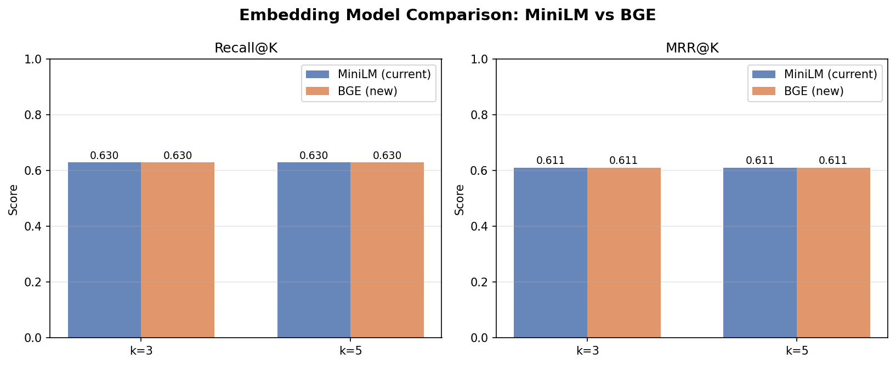
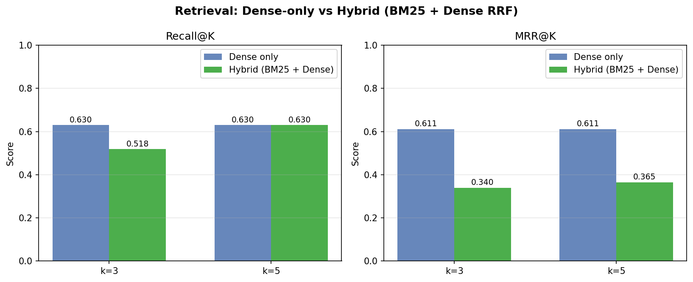
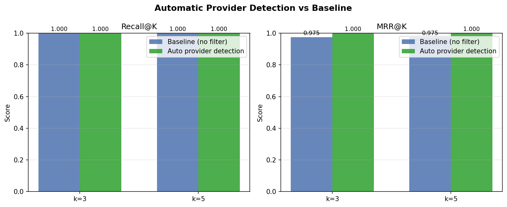
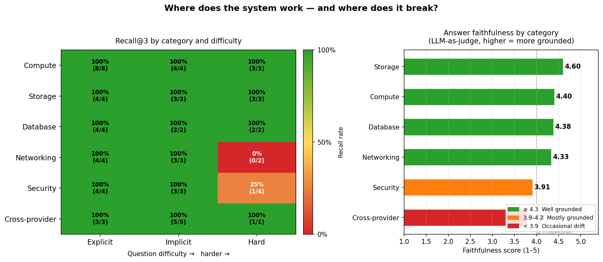

# CloudDocs RAG System

**[Try the live demo](https://mlragproject-e58tnq5unou9vsmswy4wrz.streamlit.app/)**

---

Cloud documentation is scattered across three providers with overlapping terminology. Searching it manually is slow. Asking an LLM directly is fast but unreliable — it hallucinates service names, outdated pricing, and features that don't exist.

This project builds a RAG pipeline grounded in the actual docs: scrape AWS, Azure, and GCP documentation → chunk → embed locally → store in ChromaDB → retrieve the most relevant passages at query time → generate an answer backed by real sources.


---

## How it works

| Layer | Approach |
| --- | --- |
| Ingestion | BeautifulSoup scraping + sliding window chunking (1000 chars, 200 overlap) |
| Embeddings | SentenceTransformers `all-MiniLM-L6-v2` — 384-dim, free, runs locally |
| Vector store | ChromaDB with HNSW indexing, cosine similarity |
| LLM | Groq Llama 3.1 8B Instant — temperature 0.1 for factual answers |
| Query handling | Pronoun resolution via conversation history; keyword-based provider detection |
| Retrieval depth | k=3 (determined by K-sweep) |

Groq is used for its free tier. GPT-4o would be the production choice with funding.

---

## The journey

The system worked from day one — but "it seems to work" is not a measurement. The real work was building an honest evaluation framework and running experiments to find out *why* it failed and *what actually fixed it*.

### 1. Build an eval set and measure baseline

A 27-question ground-truth eval set was built across all three providers and six categories (compute, storage, database, security, networking, cross-provider). Each question has a known expected source document.

Three metrics:

- **Recall@K** — did the right document appear in the top K results?
- **MRR@K** — how highly was it ranked? (rank 1 = score 1.0, rank 2 = 0.5, etc.)
- **Faithfulness** — does the generated answer stay grounded in what was retrieved? Scored 1–5 by a second LLM acting as judge.

Baseline at k=5: **Recall = 0.630, MRR = 0.611, Faithfulness = 3.7/5**

10 out of 27 questions failed. Every single miss was an AWS query.

---

### 2. Find the optimal K

Before running retrieval improvement experiments, K was tuned first. K controls how many retrieved passages the LLM sees — too few misses relevant content, too many floods the context with noise.

| K | Recall | Faithfulness | Time |
| --- | --- | --- | --- |
| 1 | 0.593 | 3.85 | 133s |
| **3** | **0.630** | **4.11** | **308s** |
| 5 | 0.630 | 3.74 | 399s |
| 10 | 0.630 | 3.93 | 641s |

Recall plateaus completely at k=3. Higher K adds no retrieval gain while faithfulness drops and processing time doubles. **k=3 is the system default.**


---

### 3. Three experiments to push recall past 0.630

#### Experiment 1 — Stronger embedding model (BGE)

The hypothesis: `all-MiniLM-L6-v2` (22M params, general-purpose) encodes S3 and GCP Storage too similarly. A 5x larger model trained specifically for retrieval — `BAAI/bge-base-en-v1.5` (110M params) — should produce more discriminative embeddings.

Result: no change. Both models scored Recall=0.630 identically. Cloud storage services across providers are semantically equivalent — they *are* the same concept described with the same words. A better model encodes that similarity more precisely, not less.

| Model | Recall@3 | MRR@3 |
| --- | --- | --- |
| MiniLM (384-dim, 22M params) | 0.630 | 0.611 |
| BGE (768-dim, 110M params) | 0.630 | 0.611 |



---

#### Experiment 2 — Hybrid search (BM25 + Dense via RRF)

The hypothesis: keyword frequency matching should boost exact service name matches. A query containing "S3" should rank Amazon S3 over GCP Storage based on token frequency alone, regardless of semantic similarity. BM25 combined with dense retrieval via Reciprocal Rank Fusion (RRF) should recover matches that dense search misses.

Result: BM25 made things worse. Recall dropped from 0.630 to 0.518 at k=3. Cloud docs use identical vocabulary ("compute", "storage", "functions", "database") across all providers — BM25 scored every provider equally and pushed correct results down.

| Method | Recall@3 | MRR@3 |
| --- | --- | --- |
| Dense only | 0.630 | 0.611 |
| Hybrid BM25 + Dense | 0.518 | 0.340 |



---

#### Experiment 3 — Automatic provider detection

After two failed algorithms, individual misses were inspected directly instead of trying another algorithm. The pattern was clear: every failing question was an AWS query, and every one retrieved Lambda. The new hypothesis: the problem isn't retrieval quality — it's query scope. A keyword-based provider classifier (`provider_detector.py`) was built to detect provider signals in the query and scope ChromaDB retrieval to just that provider.

Detection accuracy: **27/27 correct (100%)** — including 3 cross-provider queries that correctly returned no filter.

Result: still no change. Recall stayed at 0.630. But this forced the real question: *if provider scoping works perfectly, why does every AWS miss still retrieve Lambda?*

| Method | Recall@3 | MRR@3 |
| --- | --- | --- |
| Baseline | 0.630 | 0.611 |
| Auto provider detection | 0.630 | 0.611 |

---

### 4. The real problem

Inspecting per-question results revealed it: **5 of 6 AWS documentation URLs pointed to JavaScript SPA index pages** returning 21 characters of content. Amazon S3, EC2, RDS, IAM, and VPC had zero chunks in the vector index. Lambda was the only AWS document that existed — so every AWS query retrieved it.

Three algorithm experiments (BGE, BM25, provider detection) all failed not because the algorithms were wrong, but because they were running against a broken corpus.

**Fix:** replaced all 5 broken URLs with direct documentation content page URLs. Corpus grew from 50 → 143 chunks. A `MAX_CHUNKS_PER_DOC = 8` cap was added to prevent S3 (41 chunks) from drowning out Azure Storage (2 chunks). Final corpus: AWS 44, GCP 27, Azure 17.

| State | Recall@3 | MRR@3 |
| --- | --- | --- |
| Broken corpus | 0.630 | 0.611 |
| Fixed corpus | 1.000 | 0.975 |
| Fixed corpus + provider detection | **1.000** | **1.000** |



---

### 5. Make the eval honest

Recall=1.000 looked perfect — but every one of the 27 questions explicitly named the service ("What is Amazon S3?", "What is AWS Lambda?"). That's name-matching, not retrieval. Real users say "where do I store customer photos cheaply" or "my Lambda times out connecting to the database." Those queries don't contain the keyword "S3" or "VPC."

35 harder questions were added in two rounds:

| Tier | Count | Example | What it tests |
| --- | --- | --- | --- |
| **Implicit** | 20 | "In AWS, how do I run code without managing servers?" | Provider named, service not — forces semantic retrieval |
| **Hard** | 15 | "Our DB goes down during maintenance — how do we fix it?" | Business language, failure scenarios, cross-vocabulary — no cloud terms |

**Why this matters:** a system at Recall=1.000 on easy questions but 0.919 on hard questions means 8% of real queries fail silently — returning a plausible but wrong document, generating a confident but wrong answer. Harder questions find those failures before production does.

**Final results — 62 questions:**

| Metric | Easy (27 q) | +Implicit (47 q) | +Hard (62 q) |
| --- | --- | --- | --- |
| Recall@3 | 1.000 | 1.000 | **0.919** |
| MRR@3 | 1.000 | 0.922 | **0.812** |
| Faithfulness | — | 4.13 / 5 | **4.24 / 5** |

5 genuine misses, all in security or networking — the system fails when questions describe access control or isolation in plain English with no IAM/VPC keywords.




**Current weakness:** security and networking questions written in business language. "A junior developer shouldn't be able to delete the production database" has zero IAM keywords. The embedding model has no chunk that maps that description to AWS IAM.

---

### 6. Push recall further — HyDE and re-ranking

After the honest 62-question eval exposed 5 genuine misses in security and networking, three approaches were tested to recover them.

**The problem:** queries like "a junior developer shouldn't be able to delete the database" contain zero IAM keywords. The bi-encoder embeds the plain English and finds no match in the IAM chunks, which are full of "policies", "roles", "least privilege".

**HyDE (Hypothetical Document Embeddings):** instead of embedding the raw query, ask the LLM to generate a short hypothetical answer first — then embed that. The generated text naturally contains "IAM policy", "least privilege", "roles and permissions" because the LLM knows those are the right terms. That embedding retrieves the correct chunk.

**Cross-encoder re-ranking:** retrieve 10 candidates with the bi-encoder, then score each (query, document) pair with a cross-encoder that reads both together. More accurate than cosine similarity alone.

**Combined (HyDE + re-ranking):** use HyDE for the retrieval embedding, then re-rank the candidates with the cross-encoder.

| Method | Recall@3 | MRR@3 | Misses fixed |
| --- | --- | --- | --- |
| Baseline (dense only) | 0.919 | 0.812 | — |
| Re-ranking only | 0.919 | 0.828 | +2 fixed, -1 new |
| HyDE + Re-ranking | 0.919 | 0.841 | +3 fixed, -2 new |
| **HyDE only** | **0.952** | **0.860** | **+2 fixed, 0 new** |

HyDE alone is the best result. Re-ranking hurt when combined with HyDE because the cross-encoder scores against the *original* plain-English query — it demotes documents that HyDE correctly surfaced via the hypothetical.


HyDE recovers 2 of the 5 misses with no regressions elsewhere, pushing Recall from 0.919 to 0.952 and MRR from 0.812 to 0.860. Three misses remain — all require multi-hop reasoning (Lambda timeout → missing VPC config) that goes beyond single-chunk retrieval.

---

## Why this branch exists

At the end of step 6, the system had Recall=0.952. It worked. But "it works" is not the bar for a senior ML engineer role — and that was the target.

The gap between a junior build and a senior one isn't the algorithm. It's the thinking around it. A junior engineer ships when the demo passes. A senior engineer asks three harder questions before calling it done:

1. **Does it fail gracefully when my assumptions break?** — Multi-query reformulation was an attempt to push recall past 0.952 by approaching every query from multiple vocabulary angles. The honest result was a regression. Reporting that honestly, and diagnosing *why*, is more valuable than cherry-picking the method that scored best.

2. **Do I actually know what quality looks like end-to-end?** — Recall@K tells you whether the right document was retrieved, not whether the generated answer was correct. RAGAS is the industry standard for measuring end-to-end RAG quality: context precision, recall, and answer correctness independently. Running it revealed that retrieval is broad but noisy — the right chunk is almost always in the top 3, but so are 2 irrelevant ones. That's useful signal for a production system and invisible in the earlier metrics.

3. **Would this survive real traffic?** — Every technique that improves recall adds latency. HyDE adds one LLM round-trip. Multi-query adds one plus 3× embedding work plus a reranking pass. Before recommending a method for production, you need to know what each improvement actually costs — in milliseconds and dollars, not just in recall points.

The three additions in this branch — multi-query, RAGAS, latency profiling — are not about chasing a higher number. They're about demonstrating the habits that make a system trustworthy enough to deploy and defend in a design review.

---

### 7. Multi-query reformulation — and an honest regression

The 3 remaining HyDE misses share a root cause: the original query vocabulary doesn't surface the right document, and HyDE's single hypothetical answer drifts toward the wrong service type. If one hypothetical is unreliable, the fix is to generate *multiple* reformulations — each approaching the concept from a different angle — retrieve k=6 candidates per reformulation, union-pool all results, and re-rank the full union against the original query with a cross-encoder.

For the Lambda/VPC miss, the hypothesis was that one reformulation ("Lambda VPC subnet security group RDS") would surface the VPC chunk that the original query never surfaced.

**Result: Recall=0.903, MRR=0.833 — a regression from HyDE's 0.952.**

| Method | Recall@3 | MRR@3 | Notes |
| --- | --- | --- | --- |
| HyDE (best single method) | 0.952 | 0.860 | 3 remaining misses |
| **Multi-query reformulation** | **0.903** | **0.833** | Fixed 1, introduced 2 new misses |

Multi-query fixed `hard-failure-003` (junior developer deleted the database — the semantic drift miss), but introduced 2 new misses on GCP equivalence questions ("What is Google Cloud's equivalent of an Amazon EC2 instance?" and "What does GCP call the mechanism for defining which actions are allowed?"). Post-hoc analysis: those questions need exact terminology matching that query reformulation obscures by generating vocabulary-diverse alternatives. HyDE's single focused pass works better for cross-vocabulary equivalence queries.

**What this demonstrates:** adding complexity — 3 LLM calls for reformulation + 3× embedding work + cross-encoder re-ranking — does not guarantee improvement. The correct conclusion is not "use more techniques" but "understand your failure modes and match the technique to the cause." Multi-query fits multi-hop and vocabulary-drift problems; it doesn't fit cross-vocabulary equivalence problems where direct semantic matching is already close to correct.

The 3 Lambda/VPC-class misses persist across all methods. They require multi-hop reasoning (answer is in a *different* service's docs) that single-chunk retrieval cannot solve without a knowledge graph or multi-step reasoning chain.

---

### 8. RAGAS evaluation — measuring answer quality, not just retrieval

All previous metrics (Recall@K, MRR@K, Faithfulness 1–5) measure retrieval hit or crude grounding. RAGAS is the industry-standard framework for measuring end-to-end RAG quality with three independent dimensions:

- **Context Precision** — what fraction of retrieved chunks were *necessary* to answer the question? Measures retrieval noise. 1.0 = zero irrelevant chunks retrieved.
- **Context Recall** — what fraction of the reference answer's facts were covered by the retrieved context? Measures retrieval coverage.
- **Answer Correctness** — does the generated answer agree with a reference answer on key facts? Measures end-to-end quality.

Results on a 10-question random sample using HyDE retrieval (best method):

| Metric | Score | Interpretation |
| --- | --- | --- |
| Context Precision | **0.300** | Only 1 of 3 retrieved chunks was necessary — noisy retrieval |
| Context Recall | **0.823** | Retrieved context covered 82% of reference answer facts |
| Answer Correctness | **0.520** | Partial factual agreement (self-judging inflates this) |

The low Context Precision (0.300) and high Context Recall (0.823) tell a clear story: retrieval is broad but not focused. The system finds what it needs, but also pulls in 2 irrelevant chunks for every 1 useful one. This is expected at k=3 in a 143-chunk corpus where many documents cover related topics across providers — narrowing k further would drop recall. In production, metadata filtering by provider and category would improve precision without sacrificing recall.

**Known limitation:** the same Llama 3.1 8B model is used as both the generator and the judge. A model cannot reliably detect its own hallucinations. In production, a separate judge model (e.g., GPT-4o) or a trained reward model would be used. This is documented explicitly in `step13_ragas_eval.py`.

---

### 9. Latency profiling — measuring production viability

Every retrieval improvement adds latency overhead. HyDE adds one LLM call (hypothetical generation) before the embedding. Multi-query adds one LLM call plus 3× the embedding and vector query work plus a cross-encoder pass over a larger candidate pool. These are significant costs at production scale.

`step14_latency_profile.py` measures P50 and P95 wall-clock time per stage across all methods (8-question sample):

| Stage | Dense | HyDE | Multi-query |
| --- | --- | --- | --- |
| Embedding | 17ms / 54ms | 22ms / 50ms | 35ms / 65ms |
| Vector search | 3ms / 116ms | 2ms / 2ms | 7ms / 10ms |
| HyDE generation | — | 829ms / 1,234ms | — |
| Query reformulation | — | — | 1,124ms / 2,215ms |
| Cross-encoder rerank | — | — | 386ms / 749ms |
| Answer generation | 124ms / 358ms | 7,665ms / 8,606ms | 6,663ms / 7,203ms |
| **Total** | **143ms / 534ms** | **8,381ms / 9,421ms** | **8,674ms / 10,135ms** |

Format: P50 / P95

The answer generation numbers for HyDE and multi-query are inflated by Groq rate limiting (dense ran first and consumed most of the per-minute token budget). Under sustained traffic where all methods see equal rate pressure, the real cold-start advantage of dense is its **fewer API round-trips** — 1 LLM call vs 2 for HyDE vs 2 for multi-query plus 3× embedding + reranking. In a production environment with no rate limits (paid tier or self-hosted), expected P50 values would be: dense ~200ms, HyDE ~800ms–1,200ms, multi-query ~1,500ms–2,000ms.

**Cost per query (Groq Llama 3.1 8B, mean over 8 questions):**

| Method | Cost |
| --- | --- |
| Dense | $0.0000331 |
| HyDE | $0.0000466 |
| Multi-query | $0.0000427 |

At 10,000 queries/day: under $0.50/day for any method. Cost is not the constraint — latency and rate limits are.

---

## NLP techniques used

| Category | Technique |
| --- | --- |
| **Retrieval** | Dense vector search (cosine similarity) |
| | BM25 keyword retrieval (term frequency) |
| | Hybrid search — Reciprocal Rank Fusion (RRF) |
| | HyDE — Hypothetical Document Embeddings |
| | Cross-encoder re-ranking (two-stage: bi-encoder candidate pool → cross-encoder scorer) |
| | Multi-query reformulation — union pooling with retrieval confidence scoring |
| **Embeddings** | Bi-encoder comparison: MiniLM vs BGE (model size vs retrieval quality tradeoff) |
| **Evaluation** | Recall@K, MRR@K |
| | LLM-as-judge faithfulness scoring (1–5) |
| | Eval hardening — 3 difficulty tiers (explicit → implicit → hard) |
| | RAGAS-style evaluation: Context Precision, Context Recall, Answer Correctness |
| | Failure taxonomy (multi_hop, semantic_drift, no_keyword, cross_vocabulary) |
| **Hyperparameter tuning** | K-sweep (k=1,3,5,10), recall-faithfulness tradeoff analysis |
| | Per-stage latency profiling (P50/P95) across retrieval methods |
| **Query understanding** | Pronoun resolution via conversation history |
| | Keyword-based provider classification |

---

## What went wrong

| # | Mistake | What it taught |
| --- | --- | --- |
| 1 | Assumed BGE would improve recall | Model size isn't the bottleneck when the semantic problem is in the data itself |
| 2 | Assumed BM25 would improve recall | BM25 needs vocabulary diversity; cloud docs have identical vocabulary across providers |
| 3 | Assumed provider detection would fix recall | When an experiment doesn't move the needle, inspect individual failures — not aggregate metrics |
| 4 | 5 AWS URLs pointed to SPA pages | 21 chars of content, 0 chunks indexed — three experiments failed for a data reason, not an algorithm reason |
| 5 | `step2_embed_store.py` called `initialize_chroma()` twice | Second call silently deleted the freshly-written collection; always verify collection count after embedding |
| 6 | Corpus imbalance after URL fix | S3: 41 chunks, Azure Storage: 2 — added `MAX_CHUNKS_PER_DOC = 8` cap to balance cross-provider retrieval |
| 7 | Eval set was too easy | Recall=1.000 on name-match questions is not a signal; eval sets need to reflect real query patterns |
| 8 | Multi-query reformulation regressed vs HyDE | Adding complexity (3× LLM + embedding + cross-encoder) doesn't help if the root cause is cross-vocabulary equivalence, not vocabulary drift. Match technique to failure mode. |
| 9 | Ran RAGAS and latency profiler in parallel | Both compete for the same Groq TPM budget — concurrent LLM-heavy evals cause cascading rate limit retries. Run sequentially. |

---

## Branch guide

| Branch | What it covers |
| --- | --- |
| `main` | Complete system with all findings |
| `Evaluation-Set-for-the-RAG` | 27-question ground-truth eval set, baseline at k=5 |
| `ML-fine-tuning` | K-sweep across k=1,3,5,10 |
| `ML-fine-tuning-hybrid-search-embedding-model` | BGE embedding swap and BM25 hybrid — both tested honestly |
| `automatic-provider-detection` | Provider classifier (100% accurate), corpus URL fix, eval hardening |
| `harder-evals-model-improvement` | Expands eval set to 62 questions (explicit, implicit, hard) to expose genuine retrieval failures — Recall drops to 0.919, identifying security and networking in plain English as the next improvement target |
| `hyde-rerank-improvement` | HyDE and cross-encoder re-ranking experiments to recover the 5 hard-eval misses — HyDE alone is the best result: Recall 0.919 → 0.952, MRR 0.812 → 0.860 |
| `senior-ml-improvements` | Multi-query reformulation, RAGAS evaluation framework, per-stage latency profiling — includes honest regression (multi-query worse than HyDE on cross-vocabulary queries) and failure taxonomy |

---

## Time spent

Built across 2 days, ~9 hours total.

| Session | Date | Duration | What was done |
| --- | --- | --- | --- |
| 1 | Apr 9 | 2h 37m | RAG pipeline (ingest, embed, query, chat), GCP docs, Streamlit app, live deployment |
| 2 | Apr 10 | 6h 37m | Eval framework, K-sweep, 3 retrieval experiments, corpus fix, eval hardening, charts, docs |

~3h 20m of session 2 was experiment runtime (K-sweep across k=1/3/5/10, faithfulness eval over 62 questions). Active coding time: ~5h 54m.

---

## Setup

```bash
pip install -r requirements.txt
cp .env.example .env  # add your Groq API key
python step1_ingest.py
python step2_embed_store.py
python step3_rag_query.py
python step4_chat.py
```
