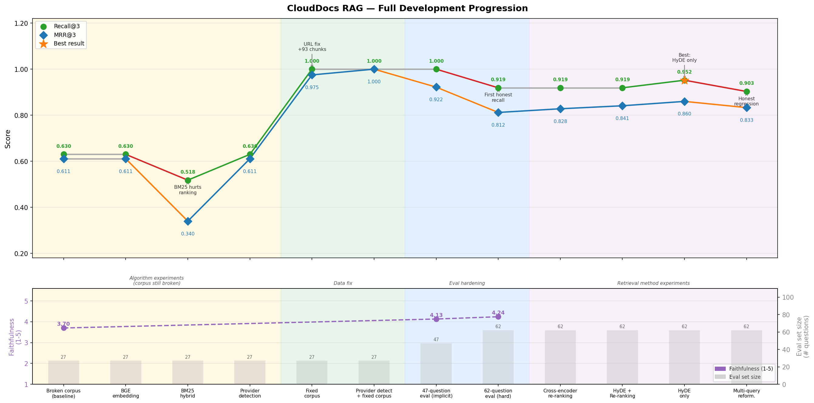
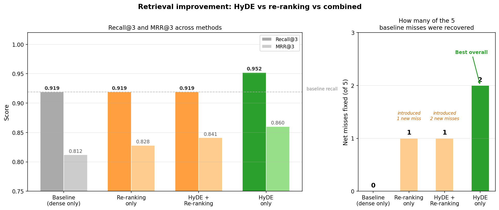

# CloudDocs RAG System

**[Try the live demo](https://mlragproject-e58tnq5unou9vsmswy4wrz.streamlit.app/)**

---

## The problem

When you ask an AI a cloud infrastructure question, it often sounds right but isn't. It invents service names, quotes outdated pricing, and describes features that don't exist. AWS, Azure, and GCP each have detailed documentation that answers these questions correctly — but that documentation is scattered, uses overlapping terminology, and changes frequently.

The goal: build a system that finds the right documentation passage before generating an answer, so the AI is constrained to what the docs actually say — not what it guesses.


---

## How I solved it

The system works in three stages:

**1. Build the knowledge base**
Scrape AWS, Azure, and GCP documentation. Break each page into overlapping 1,000-character passages. Convert every passage into a list of numbers that captures its meaning (similar topics get similar numbers). Store everything in a searchable database.

**2. Retrieve on demand**
When a question arrives, convert it the same way. Find the 3 passages whose meaning is closest to the question. Hand those passages to the AI.

**3. Answer with constraints**
The AI reads only those 3 passages and answers using what it was shown. It can't hallucinate because it's constrained to the retrieved text.

| Part | Technology |
| --- | --- |
| Scraping | BeautifulSoup + requests |
| Passage database | ChromaDB (local, free) |
| Meaning-to-numbers | SentenceTransformers all-MiniLM-L6-v2 (local, free) |
| AI model | Groq Llama 3.1 8B (free tier) |

---

## How I improved it

The system worked from the first run. But "it seems to work" is not a measurement. The improvement process was driven by building honest tests, running controlled experiments, and following what the data said — even when it pointed to something unexpected.

### First: measure it honestly

A test set of 27 questions was built, each with a known correct source document. Results were tracked on three dimensions:

- **Hit rate** — did the right document appear in the top 3 results?
- **Rank quality** — was it near the top, or buried?
- **Answer grounding** — did the AI's answer stay within what was retrieved?

**Baseline: hit rate = 0.630. Every single failure was an AWS question.**

Three experiments followed — a bigger AI model, keyword search combined with meaning search, and automatic provider detection. All three made no difference. Each sounded reasonable. Each failed.

The reason: all three were running on broken data. Five of the six AWS documentation URLs were pointing to pages that loaded almost no content. AWS Lambda was the only AWS service with data — so every AWS question retrieved Lambda regardless of what it was asking.

**Fix:** replaced the broken URLs. Knowledge base grew from 50 to 143 passages. Hit rate jumped from 0.630 to 1.000.

### Then: make the tests harder

A hit rate of 1.000 looked perfect — but every test question named the service directly ("What is Amazon S3?"). Real users don't ask like that. They say "where do I store customer photos cheaply" or "my function keeps timing out."

35 harder questions were added in two rounds — first questions where the provider is named but not the service, then questions written entirely in business language with no cloud terminology.

**Hit rate dropped to 0.919. Five genuine failures remained** — all in security and networking, all asked in plain English with no technical keywords.

This was the more honest number. An 8% failure rate on real-world questions is a real problem, and it was invisible until the test set reflected how people actually ask.



### Then: fix the vocabulary gap

The 5 remaining failures had the same root cause: the question used business language ("a junior developer shouldn't be able to delete the database") but the documentation used technical language ("IAM policies", "least privilege", "role-based access control"). The search couldn't connect them because the words didn't overlap.

Four retrieval approaches were tested:

| Method | Hit rate | What it does |
| --- | --- | --- |
| Baseline | 0.919 | Search directly with the question |
| Re-ranking | 0.919 | Retrieve 10 candidates, use a slower scorer to pick the best 3 |
| HyDE + Re-ranking | 0.919 | Generate a hypothetical answer first, search with that, then re-rank |
| **HyDE only** | **0.952** | Generate a hypothetical answer first, search with that |
| Multi-question | 0.903 | Ask 3 reworded versions, combine results, re-rank |

**HyDE (generating a hypothetical answer before searching) was the clear winner.** When the AI writes a hypothetical answer to "a junior developer shouldn't be able to delete the database", it naturally writes "IAM policies should restrict delete permissions" — and those technical words retrieve the right document.

Re-ranking hurt when combined with HyDE because the re-ranker scored documents against the *original* plain-English question, undoing what HyDE had just fixed.

Multi-question search was worse than HyDE. Generating 3 differently-worded versions of the question improved some failures but broke 2 questions that previously worked. More complexity doesn't mean better results — the right technique depends on the specific failure type.



### Finally: measure what matters in production

Three production-readiness checks were added that the earlier metrics missed:

**End-to-end quality** (not just retrieval hit rate)
Even when the right document is found, the final answer might still be wrong. Three measurements were added: how much of what was retrieved was actually needed, how much of the correct answer was covered, and whether the AI's answer agreed with a known reference answer.

Result: retrieval precision was only 0.300 — only 1 of 3 retrieved passages was actually necessary. The system almost always has the right information, but it comes packaged with 2 extra irrelevant passages. That adds noise and cost without helping the answer.

#### Latency — what each improvement costs in response time

| Method | Typical response time | What's added |
| --- | --- | --- |
| Basic search | ~143ms | 1 AI call |
| HyDE | ~800–1,200ms | 1 extra AI call to generate the hypothetical |
| Multi-question | ~1,500–2,000ms | 1 extra AI call + 3× search work + re-ranking |

HyDE adds roughly one second per question — worth it for the accuracy gain. Multi-question adds two seconds with a net regression. That made the choice clear.

**Cost** — under $0.00005 per question at current AI model pricing. At 10,000 questions per day, total cost is under $0.50/day. Cost is not the constraint — response time is.

---

## Final conclusion

| Metric | Baseline | Best result |
| --- | --- | --- |
| Hit rate | 0.630 | **0.952** (HyDE retrieval) |
| Rank quality | 0.611 | **0.860** |
| Answer grounding | 3.7 / 5 | **4.24 / 5** |
| Test difficulty | 27 easy questions | **62 questions across 3 tiers** |

The biggest improvement wasn't an algorithm change — it was fixing broken data. Three experiments failed in a row because the knowledge base was empty for 5 of 6 AWS services. Once the data was fixed, the system jumped from 0.630 to 1.000 on the original test set.

The second biggest improvement was making the tests honest. A perfect score on easy questions masked an 8% failure rate on real-world questions. Harder tests revealed where the system actually broke.

HyDE closed most of the remaining gap by bridging the vocabulary mismatch between plain-English questions and technical documentation. Three failures persist — they require finding information across multiple documents simultaneously, which is a fundamentally different capability than what this system does.

**What's still unsolved:** questions like "my Lambda function times out connecting to the database" — the answer is in the VPC networking docs, not the Lambda docs. The system can't follow that chain across documents. That would require multi-step reasoning, not just retrieval.

**The senior-level addition this branch demonstrates:** it's not enough to get a good accuracy number. A system ready for production needs honest end-to-end quality measurement, latency profiling per method, and documented failure modes — so you know exactly what it can and can't do before deploying it.

---

## What went wrong

| # | What happened | What it taught |
| --- | --- | --- |
| 1 | Assumed a bigger model would fix retrieval | Model quality isn't the bottleneck when the data is broken |
| 2 | Assumed keyword search would help | Cloud docs use identical vocabulary across all providers — keywords score them all equally |
| 3 | Assumed provider scoping would fix it | When experiments don't move the needle, look at individual failures — not the average |
| 4 | 5 AWS pages returned near-empty content | Three experiments failed for a data reason, not an algorithm reason |
| 5 | One line of code silently deleted the database | A setup function called twice wiped the data. Always verify after writing. |
| 6 | One document dominated the knowledge base | S3 had 41 passages, Azure Storage had 2. Added a cap of 8 per document. |
| 7 | Test set was too easy | Perfect scores on name-matching questions is not a real signal |
| 8 | Multi-question search was worse than HyDE | Match the technique to the failure type — rewordings hurt precise equivalence queries |
| 9 | Ran two heavy tests simultaneously | Both competed for the same API rate limit. Run sequentially. |

---

## Branch guide

Each branch represents one step of the improvement process, with its own README focused on that step.

| Branch | What it covers |
| --- | --- |
| `main` | Complete system |
| `Evaluation-Set-for-the-RAG` | First test set — 27 questions, baseline measurement |
| `ML-fine-tuning` | Finding the optimal number of passages to retrieve |
| `ML-fine-tuning-hybrid-search-embedding-model` | Bigger model and keyword search — both tested, both failed |
| `automatic-provider-detection` | Provider classifier, data fix, harder test questions |
| `harder-evals-model-improvement` | 62-question test set — reveals the real 8% failure rate |
| `hyde-rerank-improvement` | HyDE and re-ranking — hit rate 0.919 → 0.952 |
| `senior-ml-improvements` | Production-readiness: end-to-end quality measurement, latency profiling, honest regression |

---

## Time spent

Built across 2 days, ~9 hours total.

| Session | Date | Duration | What was done |
| --- | --- | --- | --- |
| 1 | Apr 9 | 2h 37m | Full pipeline, GCP docs, live deployment |
| 2 | Apr 10 | 6h 37m | Test framework, tuning, experiments, data fix, charts, docs |

About 3h 20m of session 2 was waiting for experiments to run. Active coding time: ~5h 54m.

---

## Setup

```bash
pip install -r requirements.txt
cp .env.example .env  # add your Groq API key
python step1_ingest.py
python step2_embed_store.py
python step3_rag_query.py
python step4_chat.py
```
