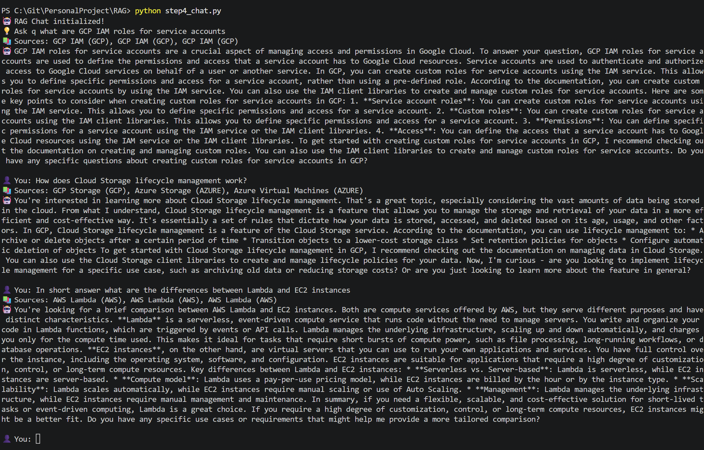
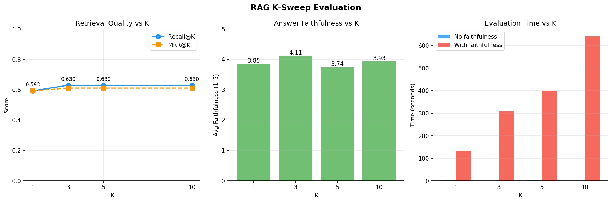

# CloudDocs RAG System

**[Try the live demo](https://mlragproject-e58tnq5unou9vsmswy4wrz.streamlit.app/)**

---

Cloud documentation is scattered across three providers, each with its own terminology and structure. Searching it manually is slow. Asking a general-purpose LLM is fast but unreliable — it hallucinates service names, outdated pricing, and non-existent features.

This project solves that by building a RAG system grounded in the actual docs. It scrapes real AWS, Azure, and GCP documentation, stores it in a vector database, and retrieves the most relevant passages before generating an answer — so every response is traceable back to a source.



---

## How it works

Real cloud docs are fetched, chunked into overlapping passages, and embedded locally using SentenceTransformers. At query time, the question is embedded the same way, and ChromaDB retrieves the closest matching passages. Those passages — not the model's prior knowledge — form the basis of the answer, generated via Groq Llama 3 8B.

**Stack:** Groq Llama 3 8B · SentenceTransformers all-MiniLM-L6-v2 (local, free) · ChromaDB

---

## Measuring whether it actually works

Saying "it seems to work" isn't enough. A 27-question ground-truth eval set was built across all three providers and six categories (compute, storage, database, security, networking, cross-provider). Each question has a known expected source, so retrieval quality can be scored automatically.

Three metrics:
- **Recall@K** — did the right document appear in the top K results?
- **MRR@K** — how highly was it ranked?
- **Faithfulness** — does the answer stay grounded in what was retrieved? Scored 1–5 by a second LLM call acting as judge.

Baseline at K=5:

| Metric | Score |
| --- | --- |
| Recall@5 | 0.63 |
| MRR@5 | 0.61 |
| Faithfulness | 3.7 / 5 |

Cross-provider questions ("compare Lambda vs Azure Functions") hit 100% recall — either doc satisfies the match. AWS-specific questions miss more often because the embedding model treats S3, GCP Storage, and Azure Blob as near-identical vectors. The model doesn't know they belong to different providers, only that they're semantically similar.

---

## Finding the optimal K

K controls how many retrieved passages get passed to the LLM. Too few and you miss relevant information. Too many and you flood the context with noise — and pay more per query.

A sweep across K = 1, 3, 5, 10 found the answer quickly:

| K | Recall | Faithfulness | Time |
| --- | --- | --- | --- |
| 1 | 0.593 | 3.85 | 133s |
| **3** | **0.630** | **4.11** | **308s** |
| 5 | 0.630 | 3.74 | 399s |
| 10 | 0.630 | 3.93 | 641s |

Recall plateaus completely at K=3. Going to K=5 or K=10 adds zero retrieval gain while faithfulness actually drops — the extra chunks introduce irrelevant context that dilutes the answer. K=3 is now the system default.



---

## Performance improvements along the way

The first version worked but was slow. A few targeted changes made a significant difference:

- **Parallel fetching** — 18 docs were being fetched one at a time with a 1s sleep between each. Switching to `ThreadPoolExecutor` eliminated ~18s of dead wait.
- **Batch embeddings** — encoding chunks one-by-one in a loop was replaced with a single `model.encode(all_chunks, batch_size=64)` call. SentenceTransformers is significantly faster in batch mode.
- **Cached singletons** — ChromaDB and tiktoken were being re-initialized on every query. Moving them to module-level singletons removed that overhead entirely.
- **Real streaming** — the original "streaming" was fake: wait for the full response, then print word-by-word with `sleep(0.05)`. The actual Groq streaming API now delivers the first token in ~100–300ms.

---

## Setup

```bash
pip install -r requirements.txt
cp .env.example .env  # add your Groq API key
python step1_ingest.py
python step2_embed_store.py
python step3_rag_query.py
python step4_chat.py
```
